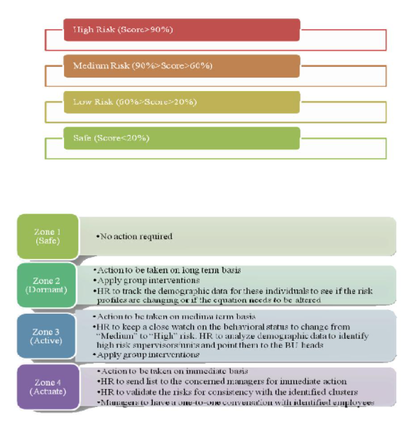

# Employee Turnover Prediction

## Overview

Employee turnover can significantly impact a company's performance and profitability. Understanding the factors that contribute to employee turnover can help companies take proactive measures to retain their workforce, thereby improving productivity and growth.

_"Employees are a company's greatest asset - they're your competitive advantage."_ - Anne M. Mulcahy

## The Challenge

Employee turnover is a common issue in the workplace and can be costly for companies. According to the _Center of American Progress_, replacing a worker earning about **50,000 dollars** costs the company about **10,000 dollars** or **20%** of that worker’s yearly income.

### Associated Costs:

* Off-boarding expenses
* Hiring costs (advertising, interviewing, hiring)
* Onboarding costs for a new hire (training, management time)
* Lost productivity (it may take 1-2 years for a new hire to reach the productivity of an existing employee)

## The Solution

While predictive models can provide valuable insights, they should not be the sole basis for decision-making when it comes to human resources. Instead, we propose using the model's predicted probabilities to create a risk zone for each employee and tailor strategies accordingly.

1. **Safe Zone (Green) –** Employees in this zone are considered safe. **[Score < 0.2]**
2. **Low Risk Zone (Yellow) –** Employees in this zone should be monitored for potential turnover in the long term.
3. **Medium Risk Zone (Orange) –** Employees in this zone are at risk of turnover. Immediate action and monitoring are required.
4. **High Risk Zone (Red) –** Employees in this zone have the highest risk of turnover. Immediate action is necessary. **[Score > 0.9]**

